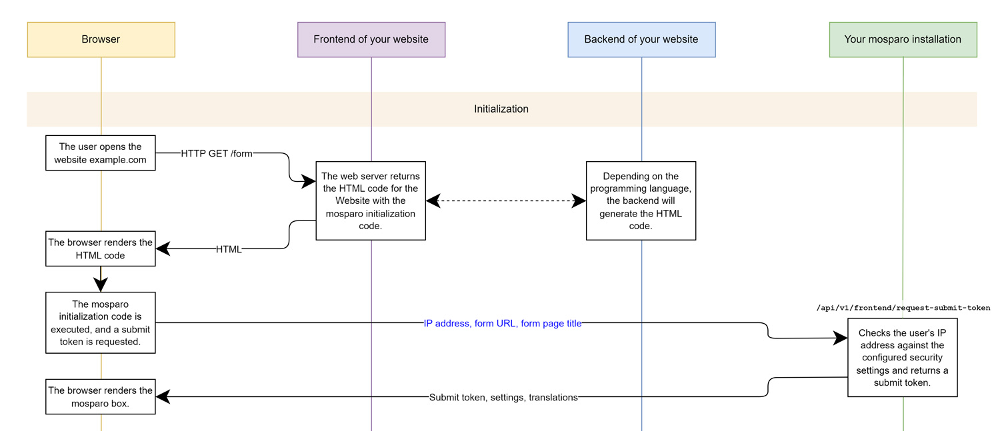
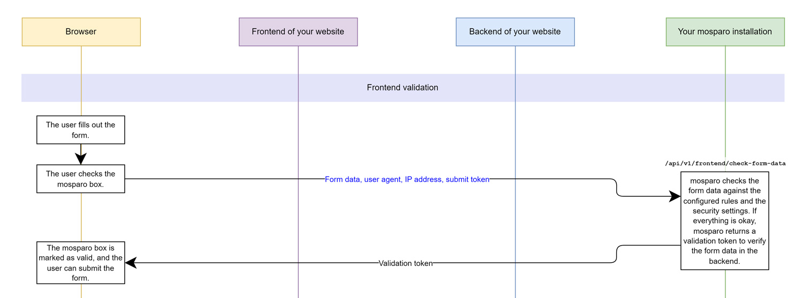
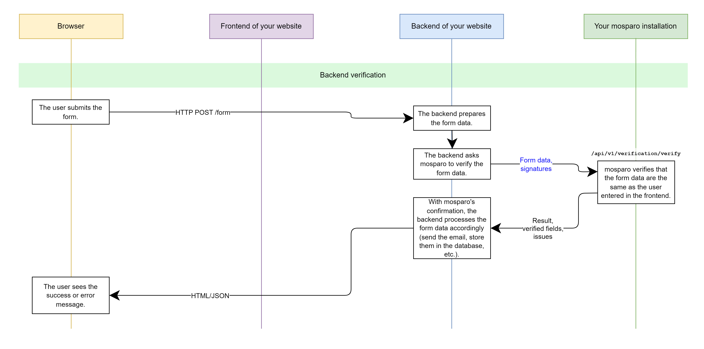

# How it works

:::info
This page describes how the visible variant works. The invisible variant (introduced with V1.0) differs from this functionality. The differences are described [at the end](#functionality-of-the-invisible-variant) of this page.
:::

## Overview

The functionality of mosparo is relatively easy to explain. Instead of using a "magic method" to determine whether a visitor to your website is a human or not, mosparo checks the data entered in the form. Someone who wants to send you spam must enter the spam content in your form. By searching through the form data, mosparo can use predefined rules to determine whether a submission should be classified as spam.

This method depends mainly on your rules and rules packages. If there are no rules or no applicable rules in your project, each submission will be rated as good, and you will receive the corresponding submission – even if it is spam.

If your rules are too restrictive, good submissions may also be blocked even though they don't contain unwanted content.

You should regularly check that no solicited submissions have been identified as spam or spam submissions have not been detected. If this is the case, you should adjust your rules.

The functionality of mosparo is based on two components. On the one hand, you must integrate a JavaScript script into your form, which adds a check box to your form. On the other hand, before processing your form, you must check whether the submission is valid. Depending on the CMS or framework, a plugin is available for the integration of mosparo (see [Plugins](../integration/with_plugins)).

## The process in detail

In the following description, the process is explained using a flow chart. You can open the chart as a PDF by clicking on the images or [here](./assets/process_chart_v1.0_EN.pdf).

### Initial request

The first step is the request when opening the form. When the form is opened, a JavaScript file is automatically loaded from mosparo. This script creates the elements that make up the box at the desired location.

Once all elements have been created, the script sends a request to the mosparo installation. This first request checks whether the user's IP address has not sent too many requests recently and is not blocked by the IP filter list. If too many requests have been sent from an IP address, either a delay is applied, or the request is blocked (see [Security settings](../usage/settings#security-settings)).

If there are no problems with the request, the request will be admitted. A temporary submission token is created. This submission token is returned to the user's browser. In addition, the correct translations for the language used by the user (if any) or the translations in the mosparo standard language are returned.

The user's browser stores this information in the browser and displays the mosparo box with the correct translations.

If mosparo returned a delay on the first request, mosparo would automatically try to receive a submission token again after the delay has expired and repeat the request.

### Validation

After filling out the form, the user clicks the mosparo checkbox. With this activation, all the form data is automatically collected and sent together with the submission token with a request to the mosparo installation for validation. The collected form data includes the field's name, the type of field (HTML5 type), and the value entered, among other things.

:::info
Some fields are ignored because they cannot contain any relevant data for the validation (see [Ignored fields](../integration/ignored_fields)).
:::

The mosparo installation checks the submitted data. mosparo can use the type of field to decide which rule types are to be applied. For each field, it is checked whether the entered values apply to one of the existing rules. If this is the case for a rule, this hit is counted. One point is calculated per hit. However, this point can be increased or decreased with the factor of the rule entry and the factor of the rule (see [Spam detection](#spam-detection)).

After all fields have been checked, it will be calculated how many points the submission has reached. If the number of points exceeds the spam limit set in the project settings, the submission will be recognized as spam and blocked.

:::info
If the honeypot function is active and the user has filled in the honeypot field, the submission will automatically be detected as spam.
:::

:::info
If the request minimum time function is active and the time between the first request and the form data validation is less than the set time, the submission will be detected as spam.
:::

If a request is recognized as valid, a signature of the request is generated, and all data is stored together with the signature. In addition, a verification token is generated and returned to the user's browser, along with the validation result.

The user is shown whether the check was successful or a problem occurred. If the verification is successful, the user can submit the form.

The randomly generated verification token is stored in the form along with the submission token.

### Verification

After the user submits the form, the website checks whether the values entered are valid. For this purpose, the website uses the submission and verification tokens and generates the submission signature, which mosparo has already created and saved.

The website transmits the submission and the verification token, together with the generated submission signature, to the API of the mosparo installation. mosparo loads the stored data from the database and checks that the verification token has not yet been used and that the website has determined the same signature as the mosparo installation before.

mosparo can use this signature verification to determine whether a request has been checked beforehand or if the user has manipulated the request. If the signatures do not match, the request is invalid and must be considered spam.

If everything is correct, the signatures are identical, and the request can be considered valid.

The submission will be marked accordingly, and mosparo will return the verification result to the website.

:::info
Certain fields are ignored because they cannot contain any data relevant for the validation (see [ignored fields](../integration/ignored_fields)).
:::

:::info
You can find the exact API functionality and how to create the signature in [performing verification](../integration/custom#performing-verification).
:::

## Spam detection

:::tip
Do you prefer a video instead of reading text? Watch our HowTo about spam rating on [YouTube](https://www.youtube.com/watch?v=mFcbiDDJl-A).
:::

mosparo must evaluate the submitted data to decide which submission is spam and which is not. This is done with the help of the existing rules. Each rule consists of at least one item. For each existing item, mosparo checks if the item matches the form data.

If this is the case, the form field receives a value in points. The default value is 1.0. When creating an item in the rules, it is possible to enter a value between 0.0 and infinity. All rules and items are now processed for each form field.

After all fields have been evaluated, the points of all fields are added together. The sum of all points will be considered as the evaluation of the entry. Whether a submission is considered spam is determined by the spam limit set in the settings.

If the sum of the points of all fields is above the spam threshold, the submission will be considered spam. It is not possible to submit the form.

If the number of points is less than the spam limit, the submission will not be considered spam. The user can submit spam and the form.

## Functionality of the invisible variant

The functionality is in large parts similar to the visible variant. The main differences are the visibility and how the data is checked in the form.

Compared to the visible variant, the mosparo box is initialized when the page is visited but is not visible. The checkbox is completely invisible and, therefore, cannot be activated by a screen reader or when navigating with the keyboard.

Once the user has filled out the form, the user starts the submit process. mosparo intervenes at this point and checks whether the mosparo checkbox is already set. This means that the check has already been performed by mosparo. If the checkbox is not set, the send process is interrupted by mosparo. mosparo then automatically starts checking the data. The data is sent to mosparo as normal and mosparo checks whether the data is spam or not.

A corresponding error message is displayed if the input contains spam and the sending process is aborted completely. If no spam was detected, mosparo automatically restarts the sending process. Since the checkbox is now set, the data is no longer rechecked, and the browser can complete the sending process.

When mosparo starts checking the data, an overlay is displayed, indicating that the data is being checked. The overlay overlays either the entire website or only the form.