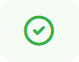
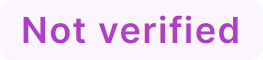

# Submissions

Under "Submissions", you will find all submissions that have not yet been deleted. Submissions will be automatically deleted after 14 days and will no longer be visible in the list of submissions.

## Explanation of columns

| Column       | Description                                                                                                                                                                                              |
|--------------|----------------------------------------------------------------------------------------------------------------------------------------------------------------------------------------------------------|
| ID           | Consecutive identification number of the submission                                                                                                                                                      |
| Page         | Indicates on which website the form was completed and submitted. The name of the page is the page title.                                                                                                 |
| IP address   | The IP address of the user. If you have enabled GeoIP functionality, the AS number, as well as the country and name of the organization, are also displayed if this information exists for an IP address. |
| Spam         | Indicates whether the submission was considered spam or not.                                                                                                                                             |
| Spam Rating  | Shows the points a submission has received and how many points would be required to be considered spam.                                                                                                  |
| Submitted at | Indicates when the user submitted the submission.                                                                                                                                                             |
| Valid        | Indicates whether the backend of a website has correctly verified the submission.                                                                                                                |
| Verified at  | Indicates when the backend of a website verified the submission.                                                                                                                                                              |

## View Submission

When you view a submission, you will see much more information about the submission. Technical information about the submission is displayed on the left. In the right column, you will find the information entered by the user as well as technical information about the user.

| Label           | Description                                                                                                                                                      |
|-----------------|------------------------------------------------------------------------------------------------------------------------------------------------------------------|
| Is spam         | Indicates whether the submission is spam.                                                                                                                        |
| Spam rating     | Shows the points a submission has received and how many points would be required to be considered spam.                                                          |
| Submitted at    | Indicates when the user submitted the submission.                                                                                                                     |
| Is valid        | Indicates whether the backend of a website has correctly verified the submission.                                                                        |
| Verified at     | Indicates when the website's backend verified the submission.                                                                                                                      |
| Page title      | Title of the website on which the form is placed.                                                                                                                |
| Page URL        | Address of the website where the form is placed.                                                                                                                 |
| Requested at    | Displays the date and time when the user accessed the form, and the browser requested the submission token.                                                                             |
| Ignored fields  | Lists all fields that have not been checked by mosparo because the fields were hidden fields or checkbox fields, for example.                                   |
| Form data       | Displays a list of all fields that exist in the form and may have been filled in (see [Form data](#form-data)).                                                  |
| IP address      | The IP address of the user who accessed the form.                                                                                                                |
| User-Agent      | The browser's identifier with which the user accessed the form. The value can be manipulated by the browser and is not to be regarded as unique information. |
| AS number       | Number of the organization registered as the owner of an IP address.                                                                                             |
| AS organization | Name of the organization registered as the owner of an IP address.                                                                                               |
| Country         | The country to which the IP address is assigned due to the AS organization.                                                                                      |

### Form data
The "Form data" box lists all form fields that have been or could be filled out in the form.

The name of the field is displayed for each form field. This is the technical name of a field and not necessarily the visual label of a field. In addition, it shows how many points a field has received and based on which rule.

You will also see a status indicator behind the name of a field. This status indicator shows whether the field in the verification was verified correctly by the backend, whether there was a problem with the verification, or whether the website's backend did not verify the field.

| Status indicator                                                         | Description                                                                                                                                                                                                                                                                                     |
|--------------------------------------------------------------------------|-------------------------------------------------------------------------------------------------------------------------------------------------------------------------------------------------------------------------------------------------------------------------------------------------|
|                              | Indicates that the field has been verified and that the data has been submitted correctly.                                                                                                                                                                                                      |
|                        | Indicates if this field contains spam and has therefore received points in the rating.                                                                                                                                                                                                          |
|  | Indicates that the field verification was unsuccessful, for example, because the website's backend did not submit the data correctly.                                                                                                                                                                              |
|                | Indicates that a field has not been verified by site backend verification. This means that the field can be changed and is rather uncertain. It is not necessarily bad because, for example, it is a not-so-important field that needs to be rechecked by the backend. |
|                           | Displayed if the field is the honeypot field. This field should always be empty. Otherwise, the submission is spam.                                                                                                                                                                              |

