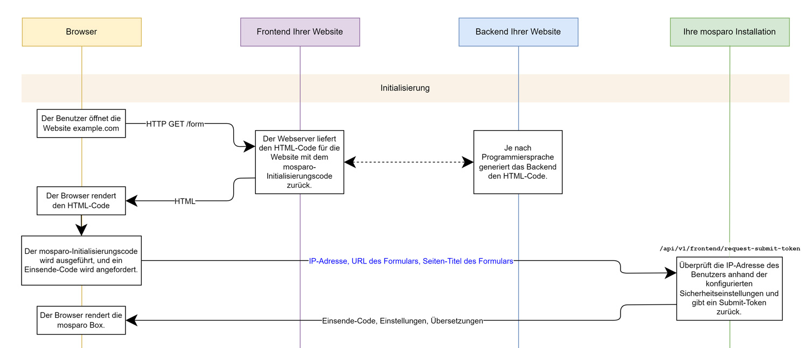
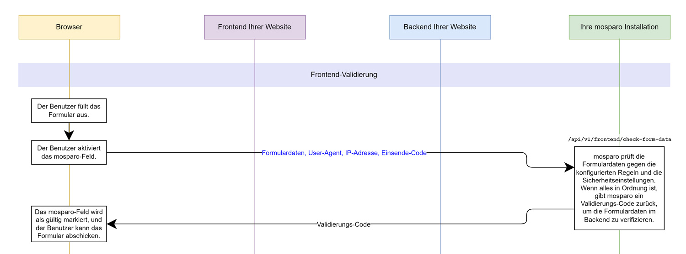
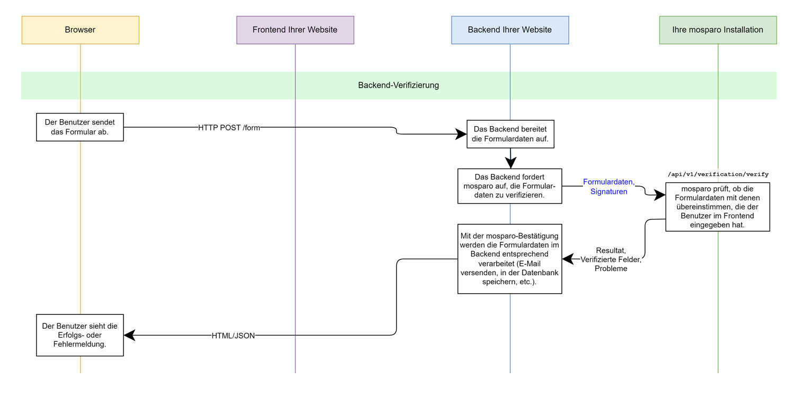

# Funktionsweise

:::info
Diese Seite beschreibt die Funktionsweise der sichtbaren Variante. Die unsichtbare Variante (eingeführt mit V1.0) weicht von dieser Funktionsweise ab. Die Unterschiede sind [am Ende](#funktionsweise-der-unsichtbaren-variante) dieser Seite beschrieben.
:::

## Übersicht

Die Funktionsweise von mosparo ist relativ einfach zu erklären. Statt mit einer "magischen Methode" zu ermitteln, ob ein Besucher Ihrer Website ein Mensch ist oder nicht, prüft mosparo die eingegebenen Daten. Wenn Ihnen jemand Spam senden möchte, muss diese Person die entsprechenden Informationen in Ihrem Formular eingeben. Durch das Durchsuchen dieser eingegebenen Daten kann mit den entsprechenden Regeln zweifelsfrei erkannt werden, ob eine Einsendung als Spam eingestuft werden soll.

Diese Methode ist zwangsläufig von Ihren Regeln und Regel-Paketen abhängig. Falls in Ihrem Projekt keine oder keine zutreffenden Regeln vorhanden sind, wird jede Einsendung als gut bewertet und Sie erhalten die entsprechende Einsendung – auch wenn es sich dabei um Spam handelt.

Falls Ihre Regeln zu restriktiv sind, kann es auch passieren, dass gute Einsendungen blockiert werden, obwohl sie keine unerwünschten Inhalte beinhalten.

Sie sollten daher regelmässig prüfen, dass keine erwünschten Einsendungen als Spam erkannt wurden und/oder Spam-Anfragen nicht erkannt wurden. Falls dies der Fall sein sollte, sollten Sie Ihre Regeln anpassen.

Die Funktionsweise von mosparo basiert grundsätzlich auf zwei Komponenten. Zum einen muss in Ihrem Formular ein spezielles Script eingebaut werden, welches ein Kontrollkästchen zu Ihrem Formular hinzufügt. Zum anderen muss vor dem Verarbeiten Ihres Formulars geprüft werden, ob die Einsendung gültig ist. Für die Integration von mosparo stehen Ihnen je nach CMS oder Framework entsprechende Lösung zur Verfügung (siehe [Integration](/docs/category/integration)).

## Der Prozess im Detail

In der folgenden Beschreibung wird der Prozess anhand eines Ablaufdiagramms erklärt. Sie können das Diagramm als PDF mit Klick auf die Bilder oder [hier](./assets/process_chart_v1.0_DE.pdf) öffnen.

### Initiale Anfrage

Der erste Schritt ist die Anfrage beim Öffnen des Formulars. Wenn das Formular geöffnet wird, wird automatisch eine JavaScript-Datei von mosparo geladen. Dieses Script erstellt an der gekennzeichneten Stelle die notwendigen Elemente, aus welchen die Box besteht.

Sobald alle Elemente erstellt wurden, sendet das Script eine Anfrage an die mosparo-Installation. Bei dieser ersten Anfrage wird geprüft, ob die IP-Adresse des Benutzers in der letzten Zeit nicht zu viele Anfragen gesendet hat und/oder nicht durch die IP-Filterliste blockiert wird. Falls von einer IP-Adresse aus zu viele Anfragen gesendet wurden, wird entweder eine Verzögerung eingebaut oder die Anfrage blockiert (siehe [Sicherheits-Einstellungen](../usage/settings#sicherheits-einstellungen)).

Wenn keine Einwände vorhanden sind, wird die Anfrage zugelassen. Es wird ein temporärer Einsendecode erstellt. Dieser Einsendecode wird dem Browser des Benutzers zurückgegeben. Zusätzlich werden die korrekten Übersetzungen für die vom Benutzer verwendete Sprache (falls vorhanden) oder die Übersetzungen in der mosparo-Standard-Sprache zurückgegeben.

Der Browser des Benutzers speichert diese Informationen im Browser und stellt die mosparo-Box entsprechend dar.

Falls bei der ersten Anfrage eine Verzögerung zurückgegeben wurde, versucht mosparo automatisch nach Ablauf der Verzögerung erneut, einen Einsendecode zu erhalten und wiederholt die Anfrage.

### Überprüfung

Nachdem der Benutzer das Formular ausgefüllt hat, aktiviert er die mosparo-Checkbox. Bei dieser Aktivierung werden automatisch alle Informationen des Formulars gesammelt und zusammen mit dem Einsendecode mit einer Anfrage an die mosparo-Installation zur Überprüfung übermittelt. Die gesammelten Formulardaten enthalten unter anderem den Namen des Feldes, den Typ des Feldes (HTML5-Typ) und den eingegebenen Wert.

:::info
Gewisse Felder werden ignoriert, da diese keine für die Prüfung relevanten Daten beinhalten können (siehe [ignorierte Felder](../integration/ignored_fields)).
:::

Die mosparo-Installation überprüft die eingesendeten Daten. Mit Hilfe des Typs des Feldes kann entschieden werden, welche Regelarten angewendet werden sollen. Pro Feld wird dann geprüft, ob die eingegebenen Werte auf eine der vorhandenen Regeln zutreffen. Falls dies für eine Regel der Fall ist, wird dieser Treffer gezählt. Pro Treffer wird ein Punkt gerechnet. Dieser Punkt kann aber mit dem Faktor des Regel-Eintrags und dem Faktor der Regel erhöht oder verringert werden (siehe [Spam-Erkennung](#spam-erkennung)).

Nachdem alle Felder überprüft wurden, wird berechnet, wie viele Punkte diese Einsendung erreicht hat. Falls die Anzahl Punkte über dem beim Projekt als Spam-Grenze festgelegten Wert liegt, wird die Einsendung als Spam erkannt.

:::info
Falls die Honeypot-Funktion aktiv ist und der Benutzer das Honeypot-Feld ausgefüllt hat, wird die Einsendung automatisch als Spam erkannt.
:::

:::info
Falls die Anfrage-Mindestzeit-Funktion aktiv ist und die Zeit zwischen der ersten Anfrage und dem Überprüfen der Formulardaten unterhalb der eingestellten Anfrage-Mindestzeit liegt, wird die Einsendung als Spam gewertet.
:::

Sofern eine Anfrage als gültig erkannt wird, wird eine Signatur der Anfrage erzeugt und alle Daten werden zusammen mit der Signatur gespeichert. Zusätzlich wird ein zufälliger Verifizierungscode generiert und dem Browser des Benutzers, zusammen mit dem Resultat der Überprüfung, zurückgegeben.

Dem Benutzer wird entsprechend dargestellt, ob die Überprüfung erfolgreich war oder ob ein Problem auftrat. Wenn die Überprüfung erfolgreich war, kann der Benutzer das Formular absenden.

Der zufällig generierte Verifizierungscode wird im Formular zusammen mit dem Einsendecode gespeichert.

### Verifizierung

Nachdem der Benutzer das Formular abgesendet hat, überprüft die Website, ob die eingegebenen Werte gültig sind. Dazu verwendet die Website den Einsende- sowie den Verifizierungscode und generiert damit die Einsendesignatur, welche mosparo selbst bereits erstellt und gespeichert hat.

Die Website übermittelt den Einsende- sowie den Verifizierungscode zusammen mit der generierten Einsendesignatur an die Schnittstelle der mosparo-Installation. mosparo lädt die gespeicherten Daten aus der Datenbank und überprüft, ob der Verifizierungs-Code noch nicht verwendet wurde und ob die Website die gleiche Signatur ermittelt hat, wie die mosparo-Installation zuvor.

Mit dieser Signatur-Überprüfung kann festgestellt werden, ob eine Anfrage zuvor wirklich geprüft wurde oder ob der Benutzer ggf. die Anfrage manipuliert hat. Falls die Signaturen nicht übereinstimmen, ist die Anfrage nicht gültig und muss als Spam gewertet werden.

Wenn alles korrekt war, sind die Signaturen identisch und daher als gültige Anfrage zu betrachten.

Die Einsendung wird entsprechend gekennzeichnet und der Website wird das Ergebnis der Überprüfung zurückgegeben.

:::info
Gewisse Felder werden ignoriert, da diese keine für die Prüfung relevanten Daten beinhalten können (siehe [ignorierte Felder](../integration/ignored_fields)).
:::

:::info
Die genaue API-Funktionsweise und das Erstellen der Signatur finden Sie unter [Verifizierung durchführen](../integration/custom#verifizierung-durchführen).
:::

## Spam-Erkennung

Damit entschieden werden kann, welche Einsendung als Spam gewertet wird und welche nicht, müssen die übermittelten Daten bewertet werden. Dies geschieht grundsätzlich mit Hilfe der vorhandenen Regeln. Jede Regel besteht aus mindestens einem Eintrag. Für jeden vorhandenen Eintrag wird überprüft, ob der Eintrag mit den Formulardaten übereinstimmt.

Wenn das der Fall ist, erhält das Formularfeld einen Wert in Punkten. Der Wert ist standardmässig 1.0. Beim Erstellen eines Eintrages in den Regeln besteht die Möglichkeit, einen Wert zwischen 0.0 und unendlich einzugeben. Für jedes Formularfeld werden nun alle Regeln und Einträge verarbeitet.

Nachdem alle Felder bewertet wurden, werden die Punkte aller Felder zusammengezählt. Die Summe aller Punkte wird als Bewertung der Einsendung betrachtet. Ob eine Einsendung als Spam gewertet wird, entscheidet nun der in den Einstellungen festgelegte Spam-Grenzwert.

Wenn die Summe der Punkte aller Felder über dem Spam-Grenzwert liegt, wird die Einsendung als Spam gewertet. Ein Absenden des Formulars ist nicht möglich.

Falls die Anzahl der Punkte kleiner ist als der Spam-Grenzwert, wird die Einsendung nicht als Spam gewertet und das Absenden des Formulars ist möglich.

## Funktionsweise der unsichtbaren Variante

Die Funktionsweise ist in grossen Teilen ähnlich wie bei der sichtbaren Variante. Die Hauptunterschiede sind die sichtbarkeit und wie die Daten im Formular überprüft werden.

Verglichen mit der sichtbaren Variante wird beim Besuchen der Seite die mosparo Box initialisiert, aber ist nicht sichtbar. Die Checkbox ist komplett unsichtbar und daher für einen Screenreader bzw. bei der Navigation mit der Tastatur nicht aktivierbar.

Sobald der Benutzer das Formular ausgefüllt hat, startet der Benutzer den Absende-Prozess. mosparo greift an dieser Stelle ein und prüft, ob die mosparo-Checkbox bereits gesetzt ist. Dies bedeutet, dass die Überprüfung durch mosparo bereits durchgeführt wurde. Falls die Checkbox nicht gesetzt ist, wird der Absende-Prozess von mosparo unterbrochen. mosparo startet dann automatisch die Überprüfung der Daten. Die Daten werden wie normal an mosparo gesendet und mosparo prüft, ob es sich bei den Daten um Spam handelt oder nicht.

Falls die Eingaben Spam enthalten, wird eine entsprechende Fehlermeldung angezeigt und der Absende-Prozess komplett abgebrochen. Falls jedoch kein Spam festgestellt wurde, startet mosparo automatisch den Absende-Prozess erneut. Da nun die Checkbox gesetzt ist, werden die Daten nicht mehr erneut geprüft und der Browser kann den Absende-Prozess abschliessen.

Sobald mosparo mit der ÜBerprüfungen der Daten beginnt, wird eine Überlagerung eingeblendet, welche auf das Prüfen der Daten hinweist. Die Überlagerung überlagert entweder die gesamte Website oder nur das Formular.