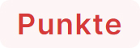
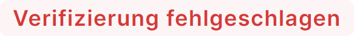

# Einsendungen

Unter “Einsendungen” finden Sie alle getätigten Einsendungen, die noch nicht gelöscht wurden. Die Einsendungen werden automatisch nach 14 Tagen gelöscht und sind daher nicht mehr in der Liste der Einsendungen zu finden.

Mit dem Dropdown-Menü in der oberen rechten Ecke können Sie die Liste der Einsendungen nach ihrem Status filtern. Um nur Einsendungen zu sehen, die Spam enthalten oder nicht korrekt verifiziert wurden, verwenden Sie die Option "Spam-Einsendungen". Verwenden Sie die Option "Gültige Einsendungen", um alle korrekt abgesendeten Einsendungen zu sehen.

## Erklärung der Spalten

| Spalte         | Beschreibung                                                                                                                                                                                                                            |
|----------------|-----------------------------------------------------------------------------------------------------------------------------------------------------------------------------------------------------------------------------------------|
| ID             | Fortlaufende Identifikationsnummer der Einsendung                                                                                                                                                                                       |
| Seite          | Gibt an, auf welcher Website das Formular ausgefüllt und abgesendet wurde. Die Bezeichnung der Seite ist der Seitentitel.                                                                                                               |
| IP-Adresse     | Die IP-Adresse des Benutzers. Wenn Sie die GeoIP-Funktionalität aktiviert haben, werden zusätzlich die AS-Nummer sowie das Land und der Name der Organisation angezeigt, sofern diese Informationen für eine IP-Adresse vorhanden sind. |
| Spam           | Gibt an, ob die Einsendung als Spam gewertet wurde oder nicht.                                                                                                                                                                          |
| Spam-Bewertung | Zeigt die Punkte an, welche eine Einsendung erhalten hat und wie viele Punkte notwendig wären, um als Spam gewertet zu werden.                                                                                                          |
| Gesendet am    | Gibt an, wann die Einsendung gesendet wurde.                                                                                                                                                                                            |
| Gültig         | Gibt an, ob die Einsendung vom Backend einer Website korrekt überprüft wurde.                                                                                                                                                           |
| Überprüft am   | Gibt an, wann die Einsendung überprüft wurde.                                                                                                                                                                                           |

## Einsendung anschauen

Wenn Sie eine Einsendung anschauen, sehen Sie viele weitere Informationen zur Einsendung. Auf der linken Seite werden technische Informationen zur Einsendung angezeigt. In der rechten Spalte finden Sie die vom Benutzer eingegebenen Informationen sowie technische Informationen zum Benutzer.

| Bezeichnung                        | Description                                                                                                                                                                          |
|------------------------------------|--------------------------------------------------------------------------------------------------------------------------------------------------------------------------------------|
| **Spam** (Box)                     |
| Ist Spam                           | Gibt an, ob es sich bei der Einsendung um Spam handelt.                                                                                                                              |
| Spam-Bewertung                     | Zeigt die Punkte an, welche eine Einsendung erhalten hat und wie viele Punkte notwendig wären, um als Spam gewertet zu werden.                                                       |
| Gesendet am                        | Gibt an, wann die Einsendung gesendet wurde.                                                                                                                                         |
| **Überprüfung** (Box)              |
| Ist gültig                         | Gibt an, ob die Einsendung korrekt vom Backend einer Website überprüft wurde.                                                                                                        |
| Überprüft am                       | Gibt an, wann die Einsendung überprüft wurde.                                                                                                                                        |
| **Allgemeine Überprüfungen** (Box) | Zeigt das Ergebnis der allgemein verifizierten aktiven Sicherheitsmerkmale an.                                                                                      |
| **Quelle** (Box)                   |
| Seiten-Titel                       | Titel der Webseite, auf welcher das Formular untergebracht ist.                                                                                                                      |
| Seiten-URL                         | Adresse der Webseite, auf welcher das Formular untergebracht ist.                                                                                                                    |
| Angefordert am                     | Zeigt das Datum und die Uhrzeit an, zu welcher das Formular aufgerufen wurde und der Einsendecode beantragt wurde.                                                                   |
| **Ignorierte Felder** (Box)        | Listet alle Felder auf, welche nicht von mosparo überprüft wurden, weil es sich bei den Feldern zum Beispiel um versteckte Felder oder um Checkbox-Feldern gehandelt hat.            |
| **Formulardaten** (Box)            | Zeigt eine Liste aller Felder an, welche im Formular vorhanden sind und ggf. ausgefüllt wurden. Siehe 3.5.2.1 Formulardaten                                                          |
| **Benutzer** (Box)                 |
| IP-Adresse                         | Die IP-Adresse des Benutzers, welcher das Formular aufgerufen hat.                                                                                                                   |
| User-Agent                         | Die Kennung des Browsers, mit welchem der Benutzer das Formular aufgerufen hat. Der Wert kann vom Browser her manipuliert werden und ist nicht als eindeutige Information zu werten. |
| AS Nummer                          | Nummer der Organisation, welcher als Besitzer einer IP-Adresse eingetragen ist.                                                                                                      |
| AS Organisation                    | Name der Organisation, welche als Besitzer einer IP-Adresse eingetragen ist.                                                                                                         |
| Land                               | Das Land, welchem die IP-Adresse aufgrund der AS Organisation zugeordnet ist.                                                                                                        |

### Formulardaten

In der Box “Formulardaten” werden alle Formularfelder aufgelistet, welche im Formular ausgefüllt wurden bzw. ausgefüllt werden könnten.

Pro Formularfeld wird der Name des Feldes angezeigt. Es handelt sich dabei um den technischen Namen eines Feldes und nicht zwingend um die Bezeichnung eines Feldes. Zusätzlich wird angezeigt, wie viele Punkte ein Feld erhalten hat und aufgrund von welchem Wort oder welcher Regel.

Weiter sehen Sie hinter dem Namen eines Feldes eine Statusanzeige. Diese Statusanzeige zeigt an, ob das Feld in der Überprüfung vom Backend korrekt überprüft wurde, ob es bei der Überprüfung ein Problem gab oder ob das Feld gar nicht überprüft wurde.

| Statusanzeige                                                            | Beschreibung                                                                                                                                                                                                                                                                                                                                  |
|--------------------------------------------------------------------------|-----------------------------------------------------------------------------------------------------------------------------------------------------------------------------------------------------------------------------------------------------------------------------------------------------------------------------------------------|
|                              | Zeigt an, dass das Feld überprüft wurde und die Daten korrekt übermittelt wurden.                                                                                                                                                                                                                                                             |
|                        | Zeigt an, falls dieses Feld Spam enthält und daher Punkte in der Bewertung erhalten hat.                                                                                                                                                                                                                                                      |
|  | Zeigt an, dass die Überprüfung des Feldes nicht erfolgreich war, weil beispielsweise die Daten nicht korrekt übermittelt wurden.                                                                                                                                                                                                              |
|                | Zeigt an, dass ein Feld nicht von der Überprüfung des Backends der Website überprüft wurde. Dies bedeutet, dass das Feld hätte verändert werden können und daher eher unsicher ist. Es ist nicht zwingend schlimm, weil es sich dabei zum Beispiel um ein nicht so wichtiges Feld handelt und daher vom Backend nicht erneut überprüft wurde. |
|                           | Wird angezeigt, wenn es sich bei dem Feld um das Honeypot-Feld handelt. Dieses Feld sollte immer leer sein, ansonsten handelt es sich bei der Einsendung um Spam.                                                                                                                                                                             |

#### Leerzeichen und unsichtbare Zeichen

Seit Version 1.4 markiert mosparo Leerzeichen am Anfang und am Ende eines Werts sowie unsichtbare Sonderzeichen im Feldwert. Diese Zeichen sind durch einen farbigen Rahmen sichtbar. Wenn Sie mit der Maus darüber fahren, wird ein Tooltip mit dem Namen des Zeichens angezeigt.

Der Grund für diese Markierung ist, Sie darauf hinzuweisen, dass der Wert Leerzeichen (am Anfang bzw. Ende) oder Sonderzeichen enthält. Wenn die Validierung einer solchen Eingabe fehlschlägt, kann es an diesen Zeichen liegen.

### Probleme bei der Überprüfung

Wenn bei der Überprüfung einer Einsendung ein Fehler auftritt, muss die Ursache für die fehlgeschlagene Überprüfung analysiert werden. Der Grund für die fehlgeschlagene Überprüfung ist jedoch nur in der Antwort der mosparo-API sichtbar, die in der Regel nicht im Backend der Website gespeichert wird. Ausserdem muss der API-Debug-Modus für ein Projekt in mosparo aktiviert sein. Normalerweise wird die API-Antwort aber nicht gespeichert, was es in einem solchen Fall schwierig macht, die Ursache für eine blockierte Einsendung zu identifizieren.

Mit v1.4 werden die Probleme während der Verifizierung automatisch in mosparo gespeichert. So kann später nachvollzogen werden, warum die Verifizierung fehlgeschlagen ist (sofern die Einsendung in mosparo gespeichert ist). Wenn es Probleme mit der Verifizierung gab, wird oben rechts in der Einsendungsansicht eine zusätzliche Schaltfläche angezeigt, über die die Verifizierungsprobleme aufgelistet werden können.

### Verifizierungs-Simulations-Modus

Wenn der Verifizierungs-Simulations-Modus für ein Projekt aktiviert ist, sehen Sie eine Schaltfläche in der oberen rechten Ecke der Detailseite der Einsendung.

Wenn Sie auf diese Schaltfläche klicken, öffnet sich ein modales Fenster, das Ihnen zeigt, wie Sie die Verifizierung in Ihrem Code durchführen müssen. Im Allgemeinen zeigt es Ihnen, wie Sie die Daten vorbereiten und welche Daten Sie mosparo zur Verfügung stellen müssen, aber es liefert Ihnen nicht den genauen Code, den Sie entwickeln müssen (da mosparo die von Ihnen verwendete Sprache nicht kennt).

Wenn Sie versuchen, eine Einsendung in Ihrem Backend zu verifizieren, müssen Sie die Daten vorbereiten, bevor Sie sie an mosparo senden. Mit dem Verifizierungs-Simulations-Modus können Sie sehen, welche Daten mosparo berechnet hat und welche Sie haben sollten. Wenn Sie diese Daten nicht haben, müssen Sie untersuchen, was Sie tun müssen, um diese Daten zu erhalten.
